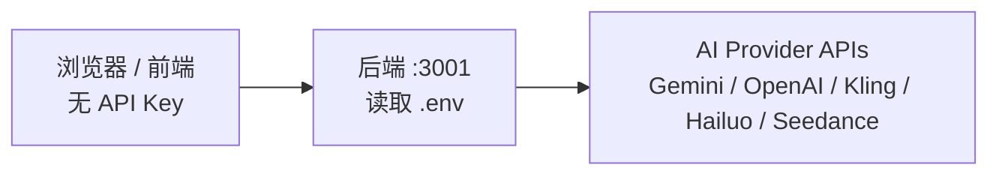

<div align="center">
  
  <h1>TwitCanva</h1>
</div>

TwitCanva 是一个现代化的 AI 画布工作流应用，用于生成、编辑和编排图片与视频。项目支持 OpenAI GPT Image、Google Gemini / Veo、Kling AI、Hailuo AI（MiniMax）、Seedance 和 Fal.ai 等多种模型，基于 React、TypeScript、Vite 与 Express 构建。


## Star 历史

[](https://www.star-history.com/#xk666-lab/TwitCanva-Video-Workflow&type=date&legend=top-left)

## 功能特性

- **可视化画布工作流**：基于节点的拖拽式图片 / 视频生成流程。
- **多模型图片生成**：支持 GPT Image、Gemini、Kling 等图片模型。
- **多模型视频生成**：支持 Veo、Seedance、Kling、Hailuo、Fal.ai 等视频生成链路。
- **分镜生成器**：通过 AI 生成故事、分镜脚本、分镜预览，并继续生成分镜视频。
- **视频模型型号选择**：在分镜视频生成中可按 provider 选择真实可调用的型号，例如 Seedance 2.0、Kling V2.1、Kling V2.5 Turbo、Hailuo 2.3 等。
- **Take / Hero Take 兼容层**：保留旧 `resultUrl` 工作流兼容，同时为后续生成历史、Take 切换和工作流回放打基础。
- **相机角度控制**：通过 Qwen Image Edit 等模型调整图片视角、旋转和倾斜。
- **Motion Control**：使用参考视频驱动角色图片动作（Kling V2.6 via Fal.ai）。
- **TikTok 导入**：下载无水印 TikTok 视频，用作动作参考素材。
- **发布到 X / TikTok**：支持将生成图片或视频直接发布到社交平台。
- **Image-to-Image**：使用参考图进行图片生成。
- **Frame-to-Frame Video**：基于首帧与尾帧生成过渡视频。
- **智能节点连接**：根据节点类型校验连接关系，例如 Image -> Video、Text -> Image。
- **AI 聊天助手**：内置基于 LangGraph 的聊天代理。
- **素材库**：保存、复用和管理生成素材。
- **工作流管理**：保存、加载和分享工作流。
- **安全 API 代理**：API Key 仅保存在后端 `.env`，不会暴露到浏览器。
- **本地开源模型支持**：可在本机 GPU 上运行 Stable Diffusion、ControlNet、Qwen 等模型。

## 演示

### 应用概览

https://github.com/user-attachments/assets/7a64d4df-7ade-4bfa-b2cd-d615d267dd40

### Motion Control 示例（Kling V2.6）

将参考视频中的动作迁移到角色图片上，例如让任意角色跳舞。

https://github.com/user-attachments/assets/1ee6cbf3-00a5-496e-852c-3304c6ebc6c9

### 输出示例

可以下载所有生成的视频片段，并使用 CapCut 等剪辑工具制作最终视频。

https://github.com/user-attachments/assets/43cf8bb8-bf85-45f9-96da-657033126d94

https://github.com/user-attachments/assets/e6f89da5-d3a6-4889-a38b-672cf37bbd79

### 相机角度控制

通过调整相机旋转、俯仰和倾斜角度来转换任意图片。

https://github.com/user-attachments/assets/f0d678df-31ac-4431-bd7c-eea3950bfb1d

### 分镜生成

创建角色一致、风格统一的 AI 视频分镜。

https://github.com/user-attachments/assets/3c36de54-d37e-4875-8403-5b6e4a6216e0

## 快速开始

### 前置要求

- Node.js 18+
- npm 或 yarn
- Google Gemini API Key：[Google AI Studio](https://aistudio.google.com/app/apikey)
- Kling AI API Key：[Kling AI Developer](https://app.klingai.com/global/dev/api-key)
- Hailuo AI API Key：[MiniMax Platform](https://platform.minimax.io/user-center/basic-information/interface-key)
- OpenAI API Key：[OpenAI Platform](https://platform.openai.com/api-keys)
- Fal.ai API Key：[Fal.ai Dashboard](https://fal.ai/dashboard/keys)，用于 Kling V2.6 Motion Control
- 可选：Seedance API Key，用于 Seedance 2.0 视频生成

### 安装

1. **克隆仓库**

   ```bash
   git clone https://github.com/xk666-lab/TwitCanva-Video-Workflow.git
   cd TwitCanva-Video-Workflow
   ```

2. **安装依赖**

   ```bash
   npm install
   ```

3. **配置环境变量**

   在项目根目录创建 `.env` 文件：

   ```env
   # Google Gemini / Veo
   GEMINI_API_KEY=your_gemini_api_key_here

   # Kling AI
   KLING_ACCESS_KEY=your_kling_access_key_here
   KLING_SECRET_KEY=your_kling_secret_key_here

   # Hailuo / MiniMax
   HAILUO_API_KEY=your_hailuo_api_key_here

   # OpenAI GPT Image
   OPENAI_API_KEY=your_openai_api_key_here
   OPENAI_BASE_URL=
   OPENAI_IMAGE_MODEL=gpt-image-2

   # Fal.ai，用于 Kling V2.6 Motion Control
   FAL_API_KEY=your_fal_api_key_here

   # Seedance 2.0
   SEEDANCE_API_KEY=your_seedance_api_key_here
   SEEDANCE_BASE_URL=
   SEEDANCE_MODEL=bytedance/seedance-2.0/text-to-video

   # 可选：X / Twitter 发布功能
   TWITTER_CLIENT_ID=your_twitter_client_id
   TWITTER_CLIENT_SECRET=your_twitter_client_secret
   TWITTER_API_KEY=your_twitter_api_key
   TWITTER_API_SECRET=your_twitter_api_secret
   TWITTER_ACCESS_TOKEN=your_twitter_access_token
   TWITTER_ACCESS_TOKEN_SECRET=your_twitter_access_token_secret
   TWITTER_CALLBACK_URL=http://127.0.0.1:3001/api/twitter/callback

   # 可选：TikTok 发布功能
   TIKTOK_CLIENT_KEY=your_tiktok_client_key
   TIKTOK_CLIENT_SECRET=your_tiktok_client_secret
   TIKTOK_CALLBACK_URL=https://your-ngrok-url.ngrok-free.app/api/tiktok-post/callback
   ```

   **安全说明**：API Key 仅在服务端读取，不会暴露到前端客户端。

4. **启动开发环境**

   ```bash
   npm run dev
   ```

   启动后会同时运行：

   - 前端开发服务：`http://localhost:5173`
   - 后端 API 服务：`http://localhost:3001`

## Docker 部署

如果希望以容器方式运行：

1. 按上方步骤准备项目和 `.env`。
2. 执行：

   ```bash
   docker compose up -d --build
   ```

应用会运行在 `http://localhost:3001`，生成数据会保存在本地 `library/` 目录。

停止服务：

```bash
docker compose down
```

## 本地开源模型（可选）

TwitCanva 支持在本地 GPU 上运行开源模型，例如 Stable Diffusion、Qwen Camera Control、ControlNet 等。该能力是可选的，不配置也可以使用云端模型。

### 要求

- NVIDIA GPU，建议 8GB 以上显存，较大模型建议 12GB 以上
- Python 3.10+
- CUDA 兼容驱动

### 安装

```bash
# 推荐：使用 npm 脚本
npm run setup:local-models

# 或直接运行脚本
# Windows:
setup-local-models.bat

# Linux / macOS:
chmod +x setup-local-models.sh
./setup-local-models.sh
```

脚本会完成：

1. 创建 Python 虚拟环境 `venv/`
2. 安装支持 CUDA 的 PyTorch
3. 创建 `models/` 目录结构
4. 测试 GPU 是否可用

### 添加模型

从 [HuggingFace](https://huggingface.co/models)、[Civitai](https://civitai.com) 等平台下载 `.safetensors`、`.ckpt`、`.pt` 文件，并放入对应目录：

| 目录 | 模型类型 | 示例 |
| --- | --- | --- |
| `models/checkpoints/` | 主图片生成模型 | Stable Diffusion 1.5、SDXL、DreamShaper、Juggernaut XL、Flux |
| `models/loras/` | LoRA 风格或角色适配器 | 艺术风格、角色 LoRA、细节增强 |
| `models/controlnet/` | 控制类模型 | OpenPose、Canny、Depth、Tile |
| `models/video/` | 视频生成模型 | AnimateDiff、Stable Video Diffusion |

### 使用本地模型

1. 在画布空白处右键。
2. 选择添加节点。
3. 选择「本地图片模型」或「本地视频模型」。
4. 从下拉列表中选择模型。
5. 输入提示词并生成。

## 相机角度控制（可选）

该功能可通过 Qwen Image Edit 模型调整图片视角。

### 方式一：云端部署（推荐）

适合没有高端 GPU 的用户。

1. 安装 Modal：

   ```bash
   pip install modal
   modal setup
   ```

2. 部署应用：

   ```bash
   modal deploy modal/camera_angle.py
   ```

3. 配置 `.env`：

   ```env
   VITE_MODAL_CAMERA_ENDPOINT=https://your-workspace--camera-angle-control-cameraangle-generate.modal.run
   ```

4. 成本控制：

   - 容器会在空闲一段时间后自动缩容。
   - 不使用时可执行 `modal app stop camera-angle-control` 停止服务。
   - 需要恢复时重新执行 `modal deploy modal/camera_angle.py`。

### 方式二：本地部署（高级）

该方式建议使用 24GB 显存 GPU，例如 RTX 3090 / 4090。

下载模型：

```bash
# 激活虚拟环境
.\venv\Scripts\activate    # Windows
source venv/bin/activate   # Linux / macOS

# 下载 fast transformer
huggingface-cli download linoyts/Qwen-Image-Edit-Rapid-AIO \
    --local-dir models/camera-control/qwen-rapid-aio \
    --include "transformer/*"

# 下载相机角度 LoRA
huggingface-cli download dx8152/Qwen-Edit-2509-Multiple-angles \
    镜头转换.safetensors \
    --local-dir models/camera-control/loras
```

建议把 HuggingFace 缓存移到非系统盘：

```powershell
[System.Environment]::SetEnvironmentVariable("HF_HOME", "D:\HuggingFace_Cache", "User")
```

启动相机角度服务：

```bash
.\start-camera-server.bat    # Windows
./start-camera-server.sh     # Linux / macOS
```

服务默认运行在 `http://localhost:8100`。

## 素材存储

生成的素材会自动保存到本地 `library/` 目录。服务启动时会自动创建缺失目录。

| 素材类型 | 目录 | 格式 | 说明 |
| --- | --- | --- | --- |
| 图片 | `library/images/` | `.png` + `.json` | 生成时自动保存 |
| 视频 | `library/videos/` | `.mp4` + `.json` | 生成时自动保存 |
| 工作流 | `library/workflows/` | `.json` | 通过 UI 手动保存 |
| 聊天记录 | `library/chats/` | `.json` | 按消息自动保存 |
| 用户素材 | `library/assets/` | 多种格式 | 用户上传文件 |

说明：

1. 服务启动时会递归创建目录。
2. 生成文件会保存到磁盘，并通过 `/library/*` URL 访问。
3. 每个素材都会有 JSON 元数据，包括提示词、时间戳、模型等信息。
4. `library/` 已加入 `.gitignore`，不会提交到仓库。

## 使用方式

### 创建节点

1. 在画布空白处双击或右键打开菜单。
2. 选择添加节点，并选择图片、视频、文本等节点类型。
3. 输入提示词。
4. 点击生成按钮。

### 连接节点

1. 鼠标悬停在节点上，显示连接按钮。
2. 从连接点拖拽到另一个节点。
3. 松开后建立连接，用于链式生成。

### 分镜到视频

1. 点击左侧工具栏中的「分镜生成器」。
2. 选择参考图，输入故事，生成分镜脚本。
3. 选择生图模型并生成分镜预览。
4. 选择「仅创建分镜图」或「创建并继续生成视频」。
5. 在视频生成器中选择视频模型和型号，例如 Seedance 2.0、Kling、Hailuo 等。

### AI 聊天

1. 点击顶部栏的聊天按钮。
2. 输入消息，或从画布附加图片。
3. AI 助手可以协助生成提示词、整理创意和分析素材。

### 保存工作流

1. 点击顶部栏的 Workflows。
2. 输入工作流名称并保存。
3. 可随时从同一面板重新加载。

### 画布导航

- 平移：拖拽空白画布区域。
- 缩放：`Ctrl/Cmd + 鼠标滚轮` 或使用缩放滑条。
- 选择：点击节点。
- 多选：`Shift + 点击` 或拖拽选择框。
- 右键菜单：打开更多操作。

## 工具

### TikTok 视频导入

用于下载无水印 TikTok 视频，并作为 Motion Control 的动作参考：

1. 点击左侧工具栏中的工具按钮。
2. 选择 Import TikTok。
3. 粘贴 TikTok 视频链接。
4. 点击导入。
5. 预览后添加到画布。

说明：首尾帧会尝试自动裁剪，以减少 TikTok 水印影响；该能力依赖系统安装 ffmpeg。

### 发布到 X / Twitter

1. 生成图片或视频。
2. 悬停媒体，点击 X 图标。
3. 首次使用时登录 X 账号。
4. 添加可选文案。
5. 点击发布。

免费额度限制请参考 [docs/post-to-x.md](docs/post-to-x.md)。

### 发布到 TikTok

1. 生成视频。
2. 悬停视频，点击 TikTok 图标。
3. 首次使用时登录 TikTok 账号。
4. 添加标题和标签。
5. 选择隐私级别。
6. 点击发布。

未审核应用通常只能发布到私密可见范围，完整设置请参考 `docs/tiktok-integration.md`。

## 可用脚本

```bash
npm run dev        # 同时启动前端与后端
npm run server     # 仅启动后端服务，端口 3001
npm run build      # 生产构建
npm run preview    # 预览生产构建
npm run typecheck  # TypeScript 类型检查
npm test           # 运行测试
```

## 安全设计

API Key 永远不会暴露给浏览器：



- API Key 只保存在 `.env`。
- `.env` 已加入 `.gitignore`。
- 所有模型请求都通过后端代理。
- 前端代码中不包含敏感密钥。

## 技术栈

### 前端

- React 18
- TypeScript
- Vite
- Tailwind CSS
- Lucide React

### 后端

- Express
- LangGraph.js
- `@google/genai`
- dotenv
- Node.js test runner

### AI 模型

#### 图片生成

| 模型 | Provider | 参考图生成 | 多图参考 |
| --- | --- | :---: | :---: |
| GPT Image 2 | OpenAI | 支持 | 支持 |
| Gemini / Nano Banana Pro | Google | 支持 | 支持 |
| Kling V1.5 | Kling AI | 支持 | 部分支持 |
| Kling V2.1 | Kling AI | 支持 | 支持 |

#### 视频生成

| 模型 | Provider | 文生视频 | 图生视频 | 帧到帧 |
| --- | --- | :---: | :---: | :---: |
| Veo 3.1 | Google | 支持 | 支持 | 支持 |
| Seedance 2.0 | ByteDance | 支持 | 支持 | 参考图模式 |
| Kling V2.1 | Kling AI | 支持 | 支持 | 部分支持 |
| Kling V2.1 Master | Kling AI | 支持 | 支持 | 部分支持 |
| Kling V2.5 Turbo | Kling AI | 支持 | 支持 | 部分支持 |
| Kling V2.6 Motion | Fal.ai | 不支持 | 支持 | Motion Control |
| Hailuo 2.3 | MiniMax | 支持 | 支持 | 支持 |
| Hailuo 2.3 Fast | MiniMax | 不支持 | 支持 | 不支持 |
| Hailuo 02 | MiniMax | 支持 | 支持 | 支持 |

#### 聊天

- Gemini 2.0 Flash
- OpenAI-compatible Chat API（可配置）

## 开发说明

### 代码风格

参考 `code-style-guide.md`：

- 组件建议控制在 300 行以内。
- 工具函数建议控制在 200 行以内。
- 优先使用明确的 TypeScript 类型。
- 对复杂逻辑添加必要注释。

### 添加新功能

1. 在 `src/components/` 添加 UI 组件。
2. 在 `src/hooks/` 添加业务 hook。
3. 在 `server/routes/` 添加后端路由。
4. 在 `src/types.ts` 更新共享类型。
5. 为纯函数或服务逻辑添加测试。

## 贡献

欢迎提交贡献：

1. Fork 仓库。
2. 创建功能分支：`git checkout -b feature/amazing-feature`。
3. 遵循项目代码风格。
4. 提交修改：`git commit -m "Add amazing feature"`。
5. 推送分支：`git push origin feature/amazing-feature`。
6. 创建 Pull Request。

## 许可证

本项目使用 Apache License 2.0。

### 商业使用

如果你将本项目用于商业用途或商业产品，请参考 [NOTICE](NOTICE) 中的通知要求。

## 致谢

- OpenAI：GPT Image 图片生成能力。
- Google Gemini / Veo：AI 生成能力。
- Kling AI：图片与视频生成能力。
- MiniMax：Hailuo 视频生成能力。
- ByteDance：Seedance 视频生成能力。
- Fal.ai：Kling V2.6 Motion Control 接入。
- LangGraph：Agent 框架。
- React 与 Vite 团队：前端工程基础设施。

---

使用 React、TypeScript，以及 OpenAI、Google、Kling、MiniMax、ByteDance、Fal.ai 等 AI API 构建。
