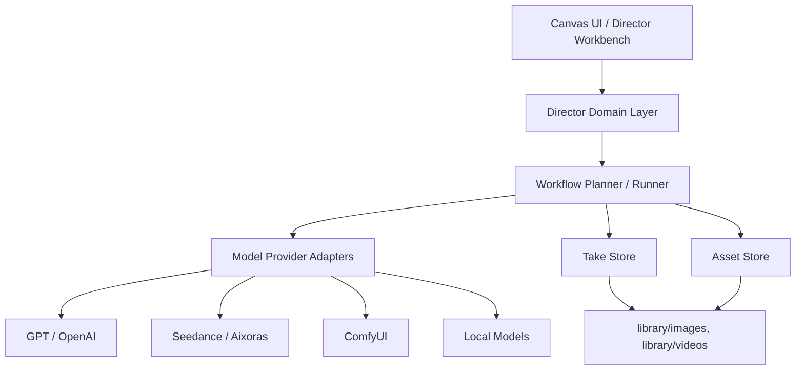

# AI 导演工作台系统架构与数据模型

## 1. 架构选择

MVP 推荐采用 **本地 Agent 架构**。

原因:
- 当前项目已经是 React/Vite + Express。
- 已有本地 `library/images`、`library/videos` 文件存储。
- 已有后端生成路由和 Seedance Provider。
- 本地开发和个人创作者场景更适合先跑通。
- 后续可以平滑演进到 SQLite、任务队列、云端对象存储和 SaaS。

## 2. 三种架构对比

| 方案 | 组成 | 优点 | 缺点 | 适用阶段 |
| --- | --- | --- | --- | --- |
| 方案 A: 纯前端轻量 MVP | React/Next.js、ReactFlow/Konva、IndexedDB、客户端 API Key、ffmpeg.wasm | 开发快、部署简单 | API Key 暴露、长任务不稳、本地文件和公网素材处理弱 | 原型验证 |
| 方案 B: 本地 Agent 架构 | React/Vite、Express/FastAPI、SQLite、文件存储、Worker Queue、本地模型/远程 API | 最适合当前项目，安全性和可扩展性平衡 | 需要设计任务队列和数据模型 | MVP 推荐 |
| 方案 C: 云端 SaaS 架构 | Next.js、NestJS/FastAPI、PostgreSQL、Redis、S3/R2/OSS、WebSocket、计费 | 可商业化、多用户、团队协作 | 初期成本高，产品未验证前容易过度设计 | 商业化阶段 |

## 3. 总体分层



## 4. 深模块设计

### Node Registry

职责:
- 注册节点类型。
- 提供默认数据。
- 定义 input/output handles。
- 绑定节点 UI。
- 绑定节点执行器。

接口草案:
```ts
interface NodeDefinition {
  type: string;
  title: string;
  defaultData: Record<string, unknown>;
  inputHandles: HandleDefinition[];
  outputHandles: HandleDefinition[];
  canRun: boolean;
  canHaveTakes: boolean;
}
```

### Graph Builder

职责:
- 根据剧情或 Agent 指令自动创建节点、边、分组。
- 负责布局。
- 不调用模型。

接口草案:
```ts
interface GraphBuilder {
  buildStoryPipeline(input: StoryPipelineInput): GraphPatch;
  buildShotImagePipeline(input: ShotImagePipelineInput): GraphPatch;
  buildVideoPipeline(input: VideoPipelineInput): GraphPatch;
}
```

### Workflow Runner

职责:
- 计算 DAG。
- 运行节点或分组。
- 处理 stale、取消、重试、日志。
- 调用 Node Executor。

接口草案:
```ts
interface WorkflowRunner {
  plan(scope: RunScope): WorkflowPlan;
  run(plan: WorkflowPlan): Promise<WorkflowRun>;
  cancel(runId: string): Promise<void>;
  retry(taskId: string): Promise<void>;
}
```

### Provider Adapter

职责:
- 隔离 GPT、Seedance、OpenAI Image、Kling、ComfyUI 等模型差异。
- 统一任务提交、轮询、结果解析。

接口草案:
```ts
interface ModelProviderAdapter {
  id: string;
  generateText(input: TextGenerationInput): Promise<TextGenerationResult>;
  generateImage(input: ImageGenerationInput): Promise<GenerationResult>;
  generateVideo(input: VideoGenerationInput): Promise<GenerationResult>;
  poll?(taskId: string): Promise<ProviderTaskStatus>;
}
```

### Take Store

职责:
- 所有图片和视频生成都创建 Take。
- 不覆盖历史结果。
- 管理 Hero Take。

接口草案:
```ts
interface TakeStore {
  createTake(input: CreateTakeInput): Promise<Take>;
  listTakes(nodeId: string): Promise<Take[]>;
  selectHeroTake(takeId: string): Promise<void>;
  getHeroTake(nodeId: string): Promise<Take | null>;
}
```

## 5. 数据模型

### Project

```json
{
  "id": "project_001",
  "title": "雪夜归国短片",
  "description": "一个流亡皇子回到故国都城",
  "canvas_ids": ["canvas_001"],
  "asset_ids": ["asset_001"],
  "created_at": "2026-07-08T00:00:00Z",
  "updated_at": "2026-07-08T00:00:00Z"
}
```

### Canvas

```json
{
  "id": "canvas_001",
  "project_id": "project_001",
  "title": "主创作画布",
  "viewport": { "x": 0, "y": 0, "zoom": 1 },
  "node_ids": ["node_text_001"],
  "edge_ids": ["edge_001"],
  "group_ids": ["group_story_001"],
  "created_at": "2026-07-08T00:00:00Z",
  "updated_at": "2026-07-08T00:00:00Z"
}
```

### Node

```json
{
  "id": "node_script_001",
  "type": "script_generator",
  "title": "生成脚本与分镜",
  "position": { "x": 420, "y": 120 },
  "size": { "width": 360, "height": 260 },
  "data": {
    "mode": "story_to_storyboard",
    "shot_count": 8,
    "duration_seconds": 30,
    "style": "cinematic anime"
  },
  "status": "success",
  "input_handles": ["story", "characters", "style"],
  "output_handles": ["script", "shots", "characters", "scenes"],
  "parent_group_id": "group_story_001",
  "created_at": "2026-07-08T00:00:00Z",
  "updated_at": "2026-07-08T00:05:00Z"
}
```

### Edge

```json
{
  "id": "edge_001",
  "source_node_id": "node_text_001",
  "source_handle": "text",
  "target_node_id": "node_script_001",
  "target_handle": "story",
  "data_mapping": {
    "text": "story"
  },
  "status": "active"
}
```

### Group

```json
{
  "id": "group_story_001",
  "project_id": "project_001",
  "canvas_id": "canvas_001",
  "title": "雪夜归国故事组",
  "type": "story_pipeline",
  "node_ids": ["node_text_001", "node_script_001", "node_storyboard_001"],
  "edge_ids": ["edge_001", "edge_002"],
  "position": { "x": 80, "y": 120 },
  "size": { "width": 1180, "height": 520 },
  "collapsed": false,
  "status": "success",
  "metadata": {
    "summary": "流亡皇子雪夜回到故国都城",
    "template_exportable": true,
    "sequence_id": "sequence_001"
  }
}
```

### Script

```json
{
  "id": "script_001",
  "node_id": "node_script_001",
  "title": "雪夜归国",
  "logline": "流亡皇子雪夜回到故国，却发现妹妹已成为敌国女帝。",
  "theme": "故国、背叛、亲情、权力",
  "full_text": "完整剧本文本",
  "character_ids": ["character_001"],
  "scene_ids": ["scene_001"],
  "shot_ids": ["shot_001"]
}
```

### Storyboard

```json
{
  "id": "storyboard_001",
  "script_id": "script_001",
  "shots": ["shot_001", "shot_002"],
  "status": "ready"
}
```

### Shot

```json
{
  "id": "shot_001",
  "storyboard_id": "storyboard_001",
  "order": 1,
  "title": "雪夜城门",
  "description": "皇子披着斗篷穿过雪夜城门。",
  "camera": {
    "shot_size": "wide",
    "movement": "slow dolly in",
    "lens": "35mm",
    "duration_seconds": 5,
    "aspect_ratio": "16:9"
  },
  "character_ids": ["character_001"],
  "scene_id": "scene_001",
  "prop_ids": [],
  "aiBrief": "雪夜、故国都城、孤独、低饱和电影感"
}
```

### Character

```json
{
  "id": "character_001",
  "name": "流亡皇子",
  "appearance": "黑色斗篷，苍白面容，银色发饰",
  "costume": "旧王族长袍与暗色披风",
  "personality": "克制、敏感、压抑怒意",
  "reference_asset_ids": ["asset_001"],
  "aiBrief": "年轻男性，王族气质，雪夜归来，克制悲伤"
}
```

### Scene

```json
{
  "id": "scene_001",
  "name": "故国都城城门",
  "time": "雪夜",
  "location": "都城外门",
  "environment": "大雪、火把、石墙、士兵剪影",
  "lighting": "冷蓝月光与暖色火把",
  "mood": "压抑、肃杀、陌生",
  "style": "cinematic anime"
}
```

### Asset

```json
{
  "id": "asset_001",
  "type": "character",
  "name": "流亡皇子参考图",
  "category": "角色",
  "url": "/library/assets/角色/prince.png",
  "metadata": {
    "character_id": "character_001",
    "source_node_id": "node_image_001"
  }
}
```

### Take

```json
{
  "id": "take_001",
  "node_id": "node_image_001",
  "asset_id": "asset_001",
  "version": 3,
  "prompt": "cinematic anime prince returning in snowy night",
  "parameters": {
    "model": "gpt-image-2",
    "aspect_ratio": "16:9"
  },
  "provider": "openai",
  "status": "success",
  "url": "/library/images/img_001.png",
  "is_hero": true,
  "created_at": "2026-07-08T00:10:00Z"
}
```

### WorkflowRun

```json
{
  "id": "run_001",
  "scope": {
    "type": "group",
    "id": "group_story_001"
  },
  "status": "running",
  "progress": 42,
  "task_ids": ["task_001", "task_002"],
  "started_at": "2026-07-08T00:00:00Z",
  "finished_at": null
}
```

### WorkflowRunLog

```json
{
  "id": "log_001",
  "run_id": "run_001",
  "node_id": "node_script_001",
  "level": "info",
  "message": "脚本生成完成，解析出 8 个镜头。",
  "created_at": "2026-07-08T00:01:00Z"
}
```

## 6. 状态机

节点状态:
- `idle`
- `queued`
- `running`
- `success`
- `failed`
- `stale`
- `cancelled`
- `needs_review`

任务状态:
- `queued`
- `submitting`
- `polling`
- `downloading`
- `saving`
- `success`
- `failed`
- `cancelled`

错误类型:
- `validation_error`
- `provider_error`
- `network_error`
- `asset_unreachable`
- `upstream_stale`
- `timeout`
- `cancelled`

## 7. 工作流执行规则

- 边代表真实数据依赖，不只是视觉连线。
- 运行节点前必须收集所有必需输入。
- 上游节点变更后，下游节点标记为 `stale`。
- 运行分组时，只运行分组内 DAG。
- 运行画布时，运行所有可运行节点。
- Image Node 生成多个 Take。
- Video Node 默认读取 Image Node 的 Hero Take。
- Compose Node 默认读取 Video Node 的 Hero Take。
- Agent Node 只能生成 GraphPatch，不直接静默修改画布。

## 8. Provider Adapter

MVP Provider:
- GPT / OpenAI: 脚本生成、Prompt 生成、图片生成。
- Seedance / Aixoras: 文生视频、图生视频。
- Existing image/video providers: 保持兼容。

第二阶段 Provider:
- ComfyUI。
- 本地 Stable Diffusion。
- Ollama。
- Kling / Hailuo / Veo 统一适配。

## 9. 文件和存储策略

MVP:
- 项目 JSON 保存到 `library/workflows`。
- 图片保存到 `library/images`。
- 视频保存到 `library/videos`。
- 素材库保存到 `library/assets`。
- 运行日志可以先写 JSON 文件或内存，后续落 SQLite。

第二阶段:
- SQLite 保存 Project、Canvas、Node、Edge、Group、Take、Run。
- 本地对象文件仍保存在 `library`。
- 云端版本迁移到 S3/R2/OSS。

## 10. 现有项目落点

优先新增:
- `src/features/director`
- `src/features/workflow`
- `src/features/takes`
- `src/features/groups`
- `server/services/director`
- `server/services/workflow`
- `server/services/providers`

优先复用:
- `src/hooks/useNodeManagement.ts`
- `src/hooks/useGeneration.ts`
- `src/hooks/useWorkflow.ts`
- `server/routes/generation.js`
- `server/routes/storyboard.js`
- `server/services/seedance.js`
- `library/images`
- `library/videos`
