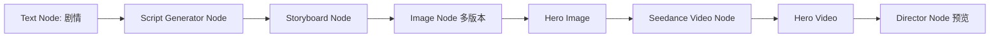

# 基于现有画布项目升级为 AI 创作型无限画布导演工作台的 MVP 开发清单

> **目标:** 在不推倒现有 TwitCanva 画布的前提下，先跑通“剧情输入 → 脚本生成 → 分镜脚本 → 自动建图 → 自动分组 → 图片/视频生成 → Hero Take → 导演台预览”的最短闭环。

## 阶段 1: 现有画布项目能力评估

**阶段目标:** 明确哪些能力复用，哪些能力补齐。

**具体任务:**
- 梳理当前节点类型、节点数据、连线、分组、保存逻辑。
- 梳理图片生成、视频生成、Seedance 接入路径。
- 梳理素材库、生成历史、分镜生成路由。
- 输出现状图和升级风险。

**技术难点:**
- 当前 `NodeData` 字段已经承载过多职责。
- 前端节点 UI、生成逻辑、后端 Provider 之间耦合较高。

**验收标准:**
- 明确列出复用文件、待拆分文件、待新增模块。
- 不修改功能行为。

**不应该做:**
- 不重写画布。
- 不迁移 ReactFlow。
- 不做大规模重构。

## 阶段 2: 节点抽象与数据结构设计

**阶段目标:** 建立可扩展节点系统，支持导演语义节点。

**具体任务:**
- 定义 Node v2、Edge v2、Group v2、Take 数据结构。
- 新增 Node Registry 概念。
- 保持旧 `NodeData` 兼容。
- 为 Script、Storyboard、Prompt、Output 节点预留类型。

**技术难点:**
- 兼容旧节点保存数据。
- 不让 `src/types.ts` 继续膨胀。

**验收标准:**
- 新旧节点能同时显示和保存。
- 新节点类型可以通过 registry 注册。

**不应该做:**
- 不一次性迁移所有旧节点。

## 阶段 3: 节点连线与 DAG 执行

**阶段目标:** 让边从视觉连线升级为真实数据依赖。

**具体任务:**
- 定义 input/output handle。
- 定义 edge data_mapping。
- 实现 DAG 拓扑排序。
- 实现上游变更后下游 stale 标记。

**技术难点:**
- 当前 `parentIds` 只能表达简单父节点关系。
- 多输入节点需要明确 handle。

**验收标准:**
- Text Node 内容能传给 Script Generator。
- Script Generator 输出能传给 Storyboard。
- 修改 Text 后 Script/Storyboard 标记过期。

**不应该做:**
- 不做复杂循环工作流。

## 阶段 4: 文本节点与脚本生成器节点

**阶段目标:** 支持剧情生成结构化脚本。

**具体任务:**
- Text Node 支持剧情输入和 aiBrief。
- Script Generator Node 支持三种模式:
  - 剧情生成分镜脚本。
  - 角色生成分镜脚本。
  - 自己编写分镜脚本。
- 后端新增严格 JSON schema。
- 增加 JSON 修复和校验。

**技术难点:**
- LLM 输出不稳定。
- 需要保证脚本、角色、场景、镜头字段可被下游使用。

**验收标准:**
- 输入一句剧情，输出完整 Script JSON。
- 至少包含 `title`、`logline`、`characters`、`scenes`、`shots`。

**不应该做:**
- 不直接生成图片和视频。

## 阶段 5: 剧情生成分镜脚本

**阶段目标:** 让脚本能被拆为可编辑分镜。

**具体任务:**
- Storyboard Node 展示镜头列表。
- 支持分镜排序。
- 支持单个分镜重写。
- 支持分镜数量、总时长、风格要求。

**技术难点:**
- 分镜既是文本，又是后续生成参数。

**验收标准:**
- Script Generator 生成后自动创建 Storyboard Node。
- Storyboard Node 能展示 6-12 条镜头。

**不应该做:**
- 不做复杂时间线剪辑。

## 阶段 6: 自动建图与自动分组

**阶段目标:** 一键从剧情生成完整创作组。

**具体任务:**
- 新增 GraphBuilder。
- 创建 Text → Script → Storyboard 节点链。
- 自动布局。
- 自动创建 Group。
- Group 自动命名。
- Group 保存到 workflow JSON。

**技术难点:**
- 自动布局要避免覆盖已有节点。
- 自动建图失败要可回滚。

**验收标准:**
- 双击画布选择“故事脚本生成”后自动出现 3 个节点和 1 个组。
- 组可整体移动、保存、恢复。

**不应该做:**
- 不做复杂模板市场。

## 阶段 7: 图片节点与多版本 Take

**阶段目标:** 图片生成不再覆盖旧结果。

**具体任务:**
- 新增 TakeStore。
- Image Node 每次生成创建新 Take。
- 节点显示 Take 列表。
- 支持重命名 Take。

**技术难点:**
- 当前生成结果写在 `resultUrl`。
- 需要兼容旧结果。

**验收标准:**
- 同一 Image Node 可保留多个生成版本。
- 旧结果不丢失。

**不应该做:**
- 不做自动评分。

## 阶段 8: Hero Take 选择

**阶段目标:** 明确下游读取哪个版本。

**具体任务:**
- Take 支持 `is_hero`。
- Image Node 支持选择 Hero Take。
- Video Node 默认读取上游 Image Hero Take。
- 上游 Hero 变化后下游标记 stale。

**技术难点:**
- Hero Take 变化必须触发依赖刷新。

**验收标准:**
- 切换图片 Hero 后，连接的视频节点显示过期。

**不应该做:**
- 不做复杂 A/B 评分。

## 阶段 9: 视频节点初版

**阶段目标:** 统一文生视频和图生视频。

**具体任务:**
- Video Node 接收 Prompt、Image Hero Take、Shot 参数。
- Seedance 文生视频和图生视频接入 Provider Adapter。
- 支持时长、比例、分辨率。
- 每次生成保存 Video Take。

**技术难点:**
- Seedance 图生视频依赖公网图片 URL。
- 任务是异步轮询。

**验收标准:**
- 文生视频可跑。
- 图生视频可跑。
- 生成结果进入 Take 列表。

**不应该做:**
- 不做复杂剪辑。

## 阶段 10: 导演台节点 MVP

**阶段目标:** 汇总创作状态和预览。

**具体任务:**
- Director Node 显示脚本、分镜、角色、场景、镜头、视频片段。
- 显示每个镜头 Hero Image / Hero Video。
- 支持预览片段顺序。
- 支持导出项目 JSON。

**技术难点:**
- Director Node 是聚合视图，不应复制所有数据。

**验收标准:**
- 能从一个 Director Node 查看完整项目进度。

**不应该做:**
- 不做完整剪辑软件。

## 阶段 11: 素材库与生成历史

**阶段目标:** 素材库从文件库升级为可复用创作资产。

**具体任务:**
- Asset 增加类型: character、scene、prop、style、image、video、audio、prompt。
- 保存节点为素材。
- 素材可拖回画布。
- 素材可作为节点输入。

**技术难点:**
- 现有素材库只有分类文件和 assets.json。

**验收标准:**
- 角色/场景/风格素材可被 Image Node 引用。

**不应该做:**
- 不做团队资产权限。

## 阶段 12: ComfyUI / 本地模型接入

**阶段目标:** Provider Adapter 可扩展。

**具体任务:**
- 定义 ComfyUI Provider。
- 支持上传图、提交 workflow、轮询结果。
- 支持本地模型地址配置。

**技术难点:**
- ComfyUI workflow 输入映射复杂。

**验收标准:**
- 至少跑通一个固定 ComfyUI 工作流。

**不应该做:**
- 不做 ComfyUI 全量编辑器。

## 阶段 13: 模板与工作流复用

**阶段目标:** Group 可导出为模板。

**具体任务:**
- Group 导出 JSON。
- 导入模板后自动创建节点和边。
- 参数脱敏。
- 保留布局。

**技术难点:**
- 模板中的节点 ID 需要重写。

**验收标准:**
- 一个故事脚本生成组可导出并复用。

**不应该做:**
- 不做模板市场。

## 阶段 14: 团队协作与云端化

**阶段目标:** 为商业化做准备。

**具体任务:**
- 设计 PostgreSQL Schema。
- 设计对象存储。
- 设计 Redis 队列。
- 设计 API Key 管理。
- 设计团队权限。

**技术难点:**
- 多租户、权限、成本控制。

**验收标准:**
- 输出 SaaS 架构设计，不要求实现。

**不应该做:**
- 不在 MVP 阶段实现。

## 最短可执行闭环

第一批开发只做这条链路:

## 第一批验收标准

- 输入一句剧情，可以自动创建 Text、Script Generator、Storyboard 三个节点。
- 三个节点自动连线。
- 三个节点自动进入一个 Group。
- Script Generator 可以生成结构化脚本和分镜 JSON。
- Storyboard 可以展示镜头列表。
- 可以从某个镜头生成图片。
- 图片支持多个 Take。
- 可以选择 Hero Image。
- 可以用 Hero Image 生成 Seedance 视频。
- 视频支持多个 Take。
- Director Node 能看到项目的脚本、镜头、Hero 图片、Hero 视频。
