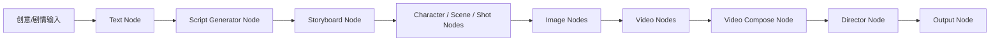

# AI 创作型无限画布导演工作台 MVP 产品规格

## 1. 产品定义

**暂定名称:** DirectorCanvas AI / 导演画布

**一句话介绍:** 在一张无限画布中，把一句剧情自动变成脚本、分镜、角色、场景、镜头、图片、视频片段和成片预览的 AI 创作导演工作台。

**目标用户:**
- AI 视频创作者
- 短视频和自媒体创作者
- 电商广告创作者
- 设计师和内容团队
- 希望用 GPT、图片模型、Seedance、ComfyUI 等模型串联创作的小团队

**核心场景:**
- 输入剧情后自动生成脚本和分镜。
- 根据脚本拆解角色、场景、镜头。
- 生成角色图、场景图、首帧图。
- 用图片和镜头描述批量生成视频。
- 对同一镜头生成多个版本，选择 Hero Take。
- 将多个视频片段合成为预览成片。
- 保存角色、场景、风格、道具到素材库复用。

**核心价值:** 用户不用在多个 AI 工具之间复制粘贴，而是在一个画布中完成创意、脚本、角色、分镜、图片、视频、素材、版本和导出。

## 2. 与参考产品的差异化

| 产品 | 可借鉴 | 不直接照搬 | 转化为本项目模块 |
| --- | --- | --- | --- |
| RunningHub | 无限画布、工作台、AI 应用中心、ComfyUI 工作流、模型/API 中心 | 不做大而全云平台和公开市场 | 快捷创作、模型中心、Provider Registry、Workflow Run |
| LibTV | 剧本生成、角色管理、分镜组、镜头设计、多版本生成、成片剪辑 | 不照搬封闭平台体验 | Director Node、Script Pipeline、分镜组、Hero Take |
| Infinite-Canvas-AI-Omnigen | 轻量无限画布、图像生成、图像编辑、视频帧提取、IndexedDB | 不把核心 API Key 放客户端长期使用 | 轻量 Web MVP、Frame Extractor、本地缓存 |
| Flowboard | ReactFlow 节点画布、Character/Visual Asset/Image/Storyboard/Video 节点、真实数据依赖、Activity Feed | 不绑定单一模型生态 | Typed Node、aiBrief、Activity Feed、本地 Agent |
| Jaaz | 聊天驱动画布、多模态 Agent、本地/远程模型混合、无限画布故事板 | 不做泛 Canva 工具 | Canvas Copilot、Asset Library、Local Provider |
| Inline Studio | Project → Sequence → Frame → Take[]、Hero Take、Video Director、ComfyUI、导入导出 | 不一开始做复杂剪辑软件 | Take Store、Hero Take Flow、Compose Node |

## 3. 现有项目升级原则

当前项目已经具备:
- 无限画布基础能力。
- 图片、视频、文本等节点。
- OpenAI / Seedance / Kling / Hailuo / Veo 等生成路径。
- 素材库雏形。
- 分镜生成路由雏形。
- 本地文件库 `library/images` 和 `library/videos`。

升级原则:
- 不推倒重写。
- 先补导演语义层，再补执行引擎。
- 旧 `NodeData` 继续兼容，新能力逐步挂到 `node.data.director` 或独立 domain store。
- 先本地单用户 MVP，后续再云端化。
- 先跑通“剧情 → 脚本 → 分镜 → 图片 → 视频”的最短闭环。

## 4. 核心创作流程

## 5. 快捷创作入口

| 入口 | 自动创建节点 | 连接关系 | 自动分组 |
| --- | --- | --- | --- |
| 故事脚本生成 | Text Node、Script Generator Node、Storyboard Node | Text → Script → Storyboard | 故事脚本生成组 |
| 角色三视图 | Text Node、Character Node、Image x3 | Text → Character → Image | 角色资产组 |
| 首帧图生视频 | Upload/Image Node、Prompt Node、Video Node | Image + Prompt → Video | 图生视频组 |
| 音频生视频 | Audio Node、Prompt Node、Video Node | Audio + Prompt → Video | 音频驱动视频组 |
| 图片生成 | Prompt Node、Image Node | Prompt → Image | 图片生成组 |
| 视频生成 | Prompt/Image Node、Video Node | Prompt 或 Image → Video | 视频生成组 |
| 导演工作台 | Text、Script、Storyboard、Shot、Image、Video、Director | 全链路 | 导演项目组 |

## 6. 节点清单

| 节点 | 用途 | 输入 | 输出 | 是否支持 Take | 是否支持 Hero |
| --- | --- | --- | --- | --- | --- |
| Text Node | 剧情、创意、设定 | 用户文本 | 文本、aiBrief | 否 | 否 |
| Prompt Node | 独立提示词 | 文本、角色、场景、镜头 | Prompt、Negative Prompt | 是 | 可选 |
| Script Generator Node | 生成脚本和分镜脚本 | 剧情、角色、场景、风格、时长、镜头数 | Script、ShotList、CharacterList、SceneList | 是 | 是 |
| Storyboard Node | 分镜管理 | Script、ShotList | 分镜表、镜头数组 | 是 | 是 |
| Character Node | 角色设定和一致性 | 名称、外貌、服装、参考图 | 角色卡、三视图、aiBrief | 是 | 是 |
| Scene Node | 场景设定 | 地点、时间、光线、氛围 | 场景卡、场景参考图、aiBrief | 是 | 是 |
| Shot Node | 镜头语言 | 分镜、角色、场景 | 景别、运镜、时长、镜头 Prompt | 是 | 可选 |
| Image Node | 图片生成 | Prompt、角色、场景、Shot | Image Take[] | 是 | 是 |
| Video Node | 视频生成 | Hero Image、Prompt、镜头、时长 | Video Take[] | 是 | 是 |
| Video Compose Node | 合成视频 | Video Hero Takes、音频、字幕 | 成片草稿 | 是 | 是 |
| Director Node | 项目总控 | Script、Storyboard、角色、场景、镜头、片段 | 预览、导出、进度汇总 | 是 | 管理全部 |
| Audio Node | 音频/旁白/音乐 | 上传音频、文本、情绪 | Audio Take[] | 是 | 是 |
| Asset Node | 引用素材库 | 素材 ID | 标准 Asset 引用 | 可选 | 可选 |
| Agent Node | 自动建图和修复 | 用户指令、画布上下文 | GraphPatch、任务建议 | 否 | 否 |
| Output Node | 最终输出 | Compose、脚本、素材 | 视频、JSON、项目包 | 否 | 否 |

## 7. 剧情驱动自动建图

用户流程:
1. 用户双击画布。
2. 选择“故事脚本生成”。
3. 输入剧情。
4. 系统创建 Text Node。
5. 系统创建 Script Generator Node。
6. Text Node 自动连接到 Script Generator Node。
7. Script Generator Node 运行，显示进度。
8. 生成完整脚本、分镜、角色列表、场景列表、镜头列表。
9. 系统创建 Storyboard Node。
10. 系统将 Text、Script、Storyboard 框为 Group。
11. 用户继续从 Storyboard 批量生成图片或视频。

节点命名:
- Text Node: 根据剧情自动命名，例如“雪夜归国剧情”。
- Script Generator Node: “生成脚本与分镜”。
- Storyboard Node: “分镜脚本”。
- Group: AI 自动命名，失败时使用“故事脚本生成组”。

布局:
- Text Node 位于左侧。
- Script Generator 位于中间。
- Storyboard 位于右侧。
- Character / Scene / Shot 后续在 Storyboard 下方纵向排列。
- Image / Video 位于更右侧，按镜头顺序排列。

## 8. MVP 必须做

- 项目创建。
- 无限画布基础操作。
- 双击画布添加节点。
- 添加节点菜单。
- 文本节点。
- Prompt 节点。
- 脚本生成器节点。
- 图片节点。
- 视频节点。
- 输出节点。
- 节点连线。
- 节点分组。
- 剧情生成分镜脚本。
- 自动创建脚本生成工作流。
- 自动分组。
- 单节点运行。
- 分组运行。
- 简单工作流运行。
- 生成进度展示。
- 取消任务。
- 运行日志。
- 多版本 Take。
- Hero Take 选择。
- 项目保存。
- 本地导入导出。

## 9. 第二阶段再做

- 角色节点。
- 角色三视图。
- 场景节点。
- 分镜节点。
- 镜头节点。
- 图生视频增强。
- 视频合成。
- 导演台节点增强。
- 素材库升级。
- 从生成历史选择。
- 自动 Prompt 增强。
- ComfyUI 接入。
- 本地 Agent。
- 模板保存。

## 10. 暂时不要做

- 工作流市场。
- 多人实时协作。
- 商业化计费。
- API 开放平台。
- 大规模云端渲染。
- 复杂视频剪辑软件能力。
- 复杂权限系统。
